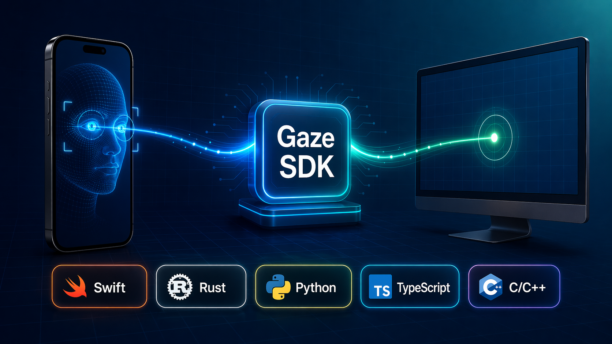

<a id="english"></a>

# 👀 Gaze SDK



**Language:** [English](#english) | [中文](#中文)

Gaze SDK turns an iPhone with ARKit face tracking into a gaze input source and maps it onto a screen. It provides ARKit gaze sampling, screen calibration, real-time gaze-to-screen solving, bare-eye and glasses correction, quick refit, residual correction, binary calibration storage, and stream protocol tooling. It supports Swift, Rust, Python, and TypeScript SDKs, plus a C/C++ core ABI for native integrations.

## ⚡ Quickstart

Capture iPhone gaze samples with `GazeProviderKit`:

```swift
import GazeProviderKit

let provider = GazeProvider()
provider.onSample = { sample in
    // Send sample to a host, record it, or feed it into your own pipeline.
    print(sample.confidence, sample.gazeOriginPM, sample.gazeDirP)
}

try provider.start()
```

Calibrate and solve screen points with `GazeCoreKit`:

```swift
import GazeCoreKit
import GazeProtocolKit

let display = GazeDisplayDescriptor(
    screenWidthMM: 345,
    screenHeightMM: 215,
    widthPixels: 3024,
    heightPixels: 1964
)

let session = GazeCalibrationSession(display: display)!
try session.pushTarget(u: 0.5, v: 0.5, targetID: 0)
try session.pushSample(sample, targetID: 0)

let calibration = try session.solve()
let point = try calibration.solvePoint(sample: sample, display: display)
print(point.xPixels, point.yPixels, point.insideScreen)
```

Encode samples for a custom stream with `GazeProtocolKit`:

```swift
import GazeProtocolKit

let payload = BinarySampleCodec.encode(sample)
let envelope = WireEnvelope(
    channel: .data,
    kind: DataMessageKind.providerSample.rawValue,
    payload: payload
)

let bytes = envelope.encode()
```

For a complete app flow, run `GazeBeamHost` on macOS and `GazeDemoApp` on a Face ID capable iPhone, then connect over LAN or USB and start host calibration.

Use host-side protocol SDKs outside Swift:

```bash
cargo add --path sdks/rust/gaze-host-sdk
python3 -m pip install -e sdks/python/gaze_host_sdk
npm install ./sdks/typescript/gaze-host-sdk
```

## ✨ Features

- ARKit gaze capture from a Face ID capable iPhone.
- Provider sample stream with gaze rays, eye rays, head pose, confidence, and face distance.
- Screen calibration and gaze-to-screen mapping.
- Bare-eye and glasses calibration states.
- Quick pose refit for display or user movement.
- Residual correction for calibrated screen points.
- Calibration quality metrics and binary serialization.
- Compact binary wire protocol for high-rate streams.
- Incremental stream decoding for TCP chunks and multi-frame buffers.
- Swift SDK for provider, protocol, and core APIs.
- Rust, Python, and TypeScript host SDKs for protocol decoding.
- Stable C ABI for native host integrations.

## 🕹️ Demo Flow

1. Launch `GazeBeamHost` on macOS.
2. Launch `GazeDemoApp` on a real iPhone that supports `ARFaceTrackingConfiguration`.
3. Pick a connection mode:
   - LAN: enter the Mac host and port shown by `GazeBeamHost`.
   - USB: install `iproxy` with `brew install libimobiledevice`, connect the iPhone by cable, and click `Start USB Bridge`.
4. Start tracking and streaming on the iPhone.
5. Click `Start Calibration` on the Mac.
6. Look at each calibration target until collection advances automatically.
7. Use the live gaze overlay after `calibration complete`.

## 📁 Repository Layout

```text
core/
  include/gaze/gaze_sdk.h       # Public C ABI
  src/gaze_sdk.cpp              # C++17 core implementation
demo/
  GazeDemoApp/                  # iPhone provider demo
  GazeBeamHost/                 # macOS host + overlay demo
  windows/                      # Windows host + overlay demo
docs/
  architecture.md               # Architecture notes
protocol/
  wire_protocol.md              # Wire protocol notes
Sources/
  GazeCoreKit/                  # Swift wrapper for core
  GazeProviderKit/              # Provider-side Swift APIs
  GazeProtocolKit/              # Protocol and codec APIs
tests/
  core_tests.cpp
  GazeProtocolKitTests/
```

## 📦 Package Manager

### ✅ Swift Package Manager

The repository contains `Package.swift` and exposes `GazeProtocolKit`, `GazeProviderKit`, and `GazeCoreKit`.

Use it from another Swift package:

```swift
.package(url: "https://github.com/zqqqqz2000/gaze.git", branch: "main")
```

Then depend on the needed product:

```swift
.product(name: "GazeCoreKit", package: "gaze")
```

### ✅ Cargo

The Rust host SDK can be used as a local path dependency:

```toml
[dependencies]
gaze-host-sdk = { path = "sdks/rust/gaze-host-sdk" }
```

### ✅ pip

The Python host SDK can be installed from the repository checkout:

```bash
python3 -m pip install -e sdks/python/gaze_host_sdk
```

### ✅ npm

The TypeScript host SDK can be installed from the repository checkout:

```bash
npm install ./sdks/typescript/gaze-host-sdk
```

## 🔧 Technical Details

### Architecture

Gaze SDK is split into three layers:

- Provider: iPhone ARKit capture and sample streaming.
- Core: display pose, tangent-affine correction, calibration, refit, residual correction, and runtime solve.
- Host: connection management, calibration UI, overlay rendering, diagnostics, and persistence.

### Coordinate Model

- Screen frame origin is the screen center.
- Screen `+X` points right.
- Screen `+Y` points up.
- Screen `+Z` points from the screen toward the user.
- Provider frame is defined by the provider.
- `T_provider_from_screen` bridges the screen frame into provider coordinates.

### Calibration Model

`gaze_calibration_t` stores:

- Screen pose as `T_provider_from_screen`.
- Bare-eye tangent-affine correction.
- Optional glasses tangent-affine correction.
- Residual polynomial coefficients.
- Quality metrics and sample counts.

The runtime solve path applies the active tangent-affine correction, intersects the corrected ray with the calibrated screen plane, applies residual correction, and returns normalized and pixel-space coordinates.

---

<a id="中文"></a>

# 👀 Gaze SDK 中文

**语言:** [English](#english) | [中文](#中文)

Gaze SDK 将支持 ARKit 人脸追踪的 iPhone 变成眼动输入源，并映射到屏幕。SDK 提供 ARKit gaze 采样、屏幕校准、实时 gaze-to-screen 解算、裸眼/眼镜修正、quick refit、residual 修正、校准二进制存储和流协议工具。当前支持 Swift、Rust、Python、TypeScript SDK，并提供 C/C++ core ABI 方便原生集成。

## ⚡ 快速开始

用 `GazeProviderKit` 在 iPhone 侧采集 gaze sample：

```swift
import GazeProviderKit

let provider = GazeProvider()
provider.onSample = { sample in
    // 可以发送给 host、落盘，或接入你自己的实时处理链路。
    print(sample.confidence, sample.gazeOriginPM, sample.gazeDirP)
}

try provider.start()
```

用 `GazeCoreKit` 在 host 侧做校准和屏幕点解算：

```swift
import GazeCoreKit
import GazeProtocolKit

let display = GazeDisplayDescriptor(
    screenWidthMM: 345,
    screenHeightMM: 215,
    widthPixels: 3024,
    heightPixels: 1964
)

let session = GazeCalibrationSession(display: display)!
try session.pushTarget(u: 0.5, v: 0.5, targetID: 0)
try session.pushSample(sample, targetID: 0)

let calibration = try session.solve()
let point = try calibration.solvePoint(sample: sample, display: display)
print(point.xPixels, point.yPixels, point.insideScreen)
```

用 `GazeProtocolKit` 编码 sample，接入自定义网络流：

```swift
import GazeProtocolKit

let payload = BinarySampleCodec.encode(sample)
let envelope = WireEnvelope(
    channel: .data,
    kind: DataMessageKind.providerSample.rawValue,
    payload: payload
)

let bytes = envelope.encode()
```

如果需要完整 app 流程，可以在 macOS 上运行 `GazeBeamHost`，在支持 Face ID/ARKit Face Tracking 的 iPhone 真机上运行 `GazeDemoApp`，通过 LAN 或 USB 连接后开始 host 侧校准。

在 Swift 之外使用 host 侧协议 SDK：

```bash
cargo add --path sdks/rust/gaze-host-sdk
python3 -m pip install -e sdks/python/gaze_host_sdk
npm install ./sdks/typescript/gaze-host-sdk
```

## ✨ 能力特性

- 从支持 Face ID 的 iPhone 采集 ARKit gaze。
- 输出 gaze ray、eye ray、头部位姿、confidence、face distance。
- 屏幕校准和 gaze-to-screen 映射。
- 裸眼和眼镜两套校准状态。
- 面向显示器或用户移动的 quick pose refit。
- 校准屏幕点 residual 修正。
- 校准质量指标和二进制序列化。
- 面向高频流的紧凑二进制协议。
- 支持 TCP 分片和多帧 buffer 的增量解码。
- Swift SDK 覆盖 provider、protocol、core API。
- Rust、Python、TypeScript host SDK 支持协议解码。
- 稳定 C ABI 支持原生 host 集成。

## 🕹️ Demo 流程

1. 在 Mac 上启动 `GazeBeamHost`。
2. 在支持 `ARFaceTrackingConfiguration` 的 iPhone 真机上启动 `GazeDemoApp`。
3. 选择连接方式：
   - LAN：在 iPhone 端填写 host 窗口显示的 Mac IP 和端口。
   - USB：用 `brew install libimobiledevice` 安装 `iproxy`，数据线连接 iPhone，点击 host 里的 `Start USB Bridge`。
4. iPhone 端开始 tracking 和 streaming。
5. Mac 端点击 `Start Calibration`。
6. 依次看向每个校准点，等待自动采样完成。
7. 状态显示 `calibration complete` 后即可使用实时 gaze overlay。

## 📁 目录结构

```text
core/
  include/gaze/gaze_sdk.h       # 公共 C ABI
  src/gaze_sdk.cpp              # C++17 核心实现
demo/
  GazeDemoApp/                  # iPhone provider demo
  GazeBeamHost/                 # macOS host + overlay demo
  windows/                      # Windows host + overlay demo
docs/
  architecture.md               # 架构说明
protocol/
  wire_protocol.md              # 协议说明
Sources/
  GazeCoreKit/                  # core 的 Swift 封装
  GazeProviderKit/              # provider 侧 Swift API
  GazeProtocolKit/              # 协议和 codec API
tests/
  core_tests.cpp
  GazeProtocolKitTests/
```

## 📦 包管理器

### ✅ Swift Package Manager

仓库已经提供 `Package.swift`，并暴露 `GazeProtocolKit`、`GazeProviderKit`、`GazeCoreKit`。

在其他 Swift package 中添加：

```swift
.package(url: "https://github.com/zqqqqz2000/gaze.git", branch: "main")
```

然后依赖需要的 product：

```swift
.product(name: "GazeCoreKit", package: "gaze")
```

### ✅ Cargo

Rust host SDK 可作为本地 path dependency 使用：

```toml
[dependencies]
gaze-host-sdk = { path = "sdks/rust/gaze-host-sdk" }
```

### ✅ pip

Python host SDK 可从仓库 checkout 安装：

```bash
python3 -m pip install -e sdks/python/gaze_host_sdk
```

### ✅ npm

TypeScript host SDK 可从仓库 checkout 安装：

```bash
npm install ./sdks/typescript/gaze-host-sdk
```

## 🔧 技术细节

### 架构

Gaze SDK 分三层：

- Provider：iPhone ARKit 采集和 sample 推流。
- Core：屏幕位姿、tangent-affine 修正、校准、refit、residual 修正和实时解算。
- Host：连接管理、校准 UI、overlay 渲染、诊断和持久化。

### 坐标模型

- Screen frame 原点在屏幕中心。
- Screen `+X` 指向屏幕右侧。
- Screen `+Y` 指向屏幕上方。
- Screen `+Z` 从屏幕指向用户。
- Provider frame 由 provider 定义。
- `T_provider_from_screen` 负责把 screen frame 桥接到 provider 坐标系。

### 校准模型

`gaze_calibration_t` 包含：

- 屏幕位姿 `T_provider_from_screen`。
- 裸眼 tangent-affine 修正。
- 可选眼镜 tangent-affine 修正。
- residual 多项式系数。
- 质量指标和样本数。

运行时解算会应用当前 active 的 tangent-affine 修正，将修正后的射线与校准屏幕平面求交，应用 residual 修正，并返回 normalized 与 pixel-space 坐标。
